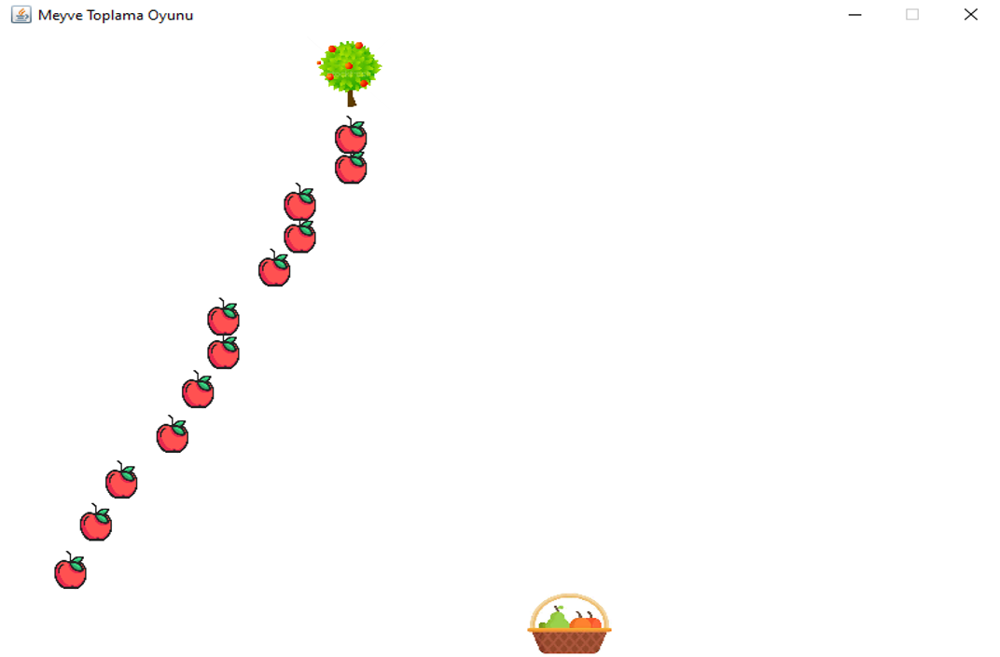

# Fruit Picking Game

Fruit Collecting Game appeals to children aged 4-10.

The aim of the game is to collect 10 fruits in the basket in the fastest time and using less fruit.

The score is calculated according to the fruit thrown in the game and the elapsed time, and when the game is over, the user's score is written on the screen.

The tree is moved with the arrow keys.

We throw the fruits with the spacebar.

The basket moves left and right at the speed we set.

The fruits disappear when they hit the basket and the game is over when 10 fruits are collected in total.

The data is written to the file and saved in the database.

## Screenshots

## Author

- Linkedin: [@acarbaran](https://www.linkedin.com/in/acarbaran/)

## Contributing

Contributions, issues and feature requests are welcome!

Feel free to check `issues page`

## License

Copyright © 2022 all rights reserved

